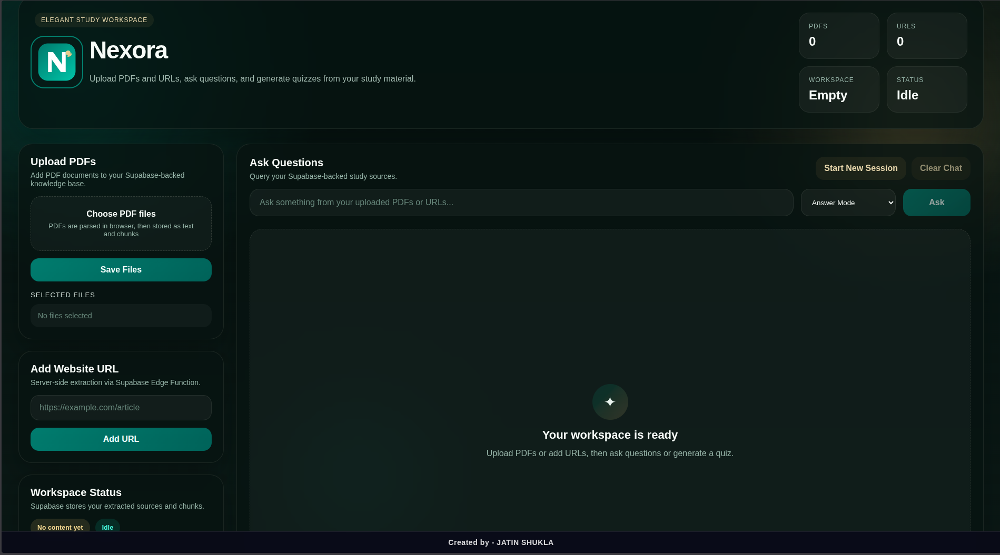
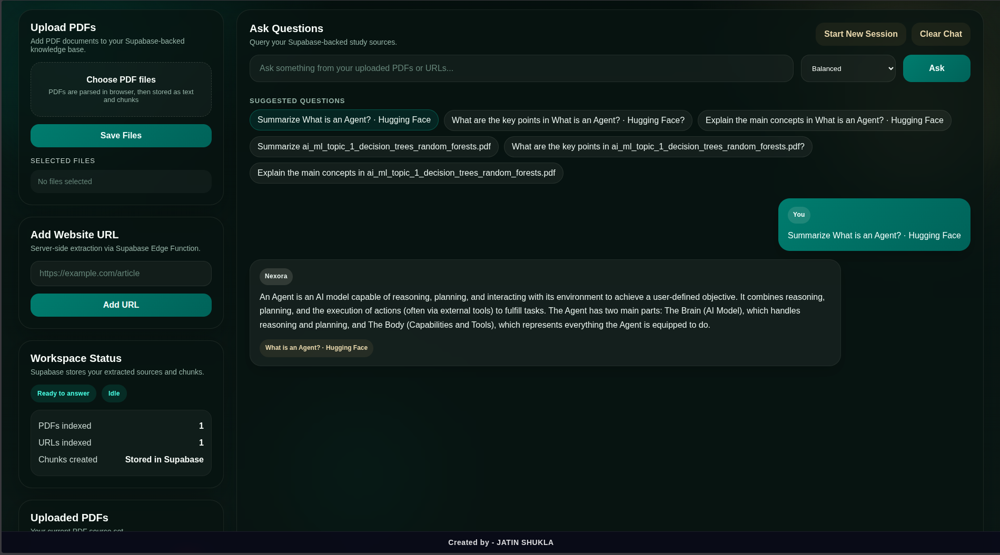
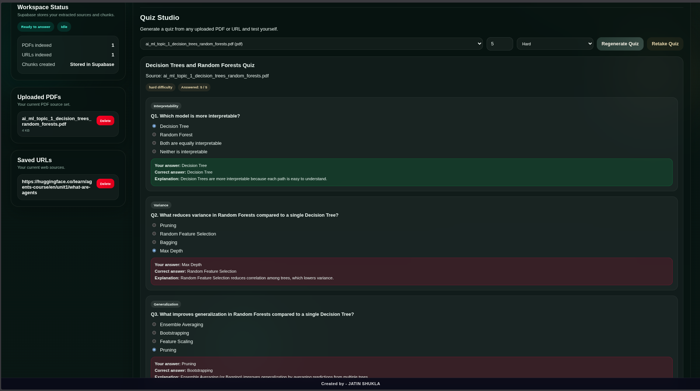
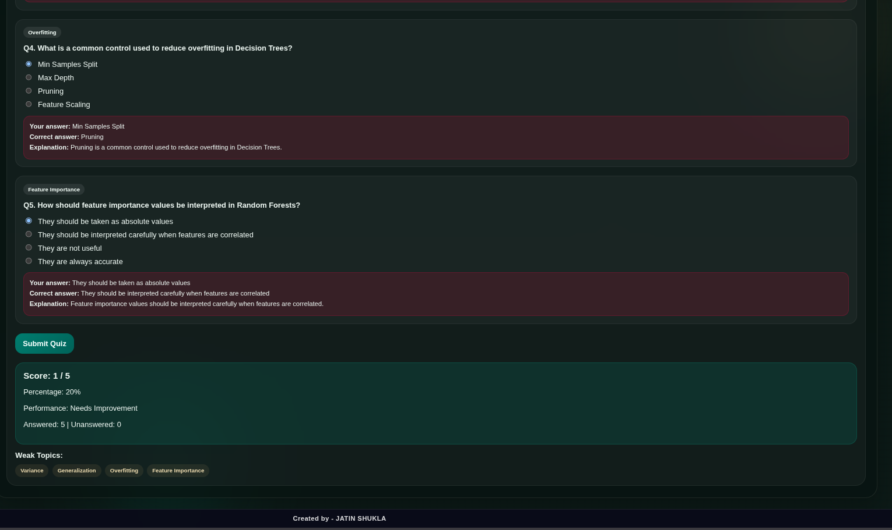

# Nexora

Nexora is a full-stack AI-powered study assistant that allows users to upload PDFs and web content, ask grounded questions, and generate quizzes from their learning material.

It is designed as a polished study workspace with source-based retrieval, multiple answer styles, and quiz-based revision support.

## Live Demo

Add your deployed frontend link here:

https://nexora-one-ashen.vercel.app

---

## Architecture

### Current Live Architecture
- Frontend: Vercel
- Database and backend services: Supabase
- AI orchestration: Supabase Edge Functions + Groq

### Legacy Backend
This repository also contains an earlier FastAPI-based backend implementation for reference.

## Features

- Upload and process PDF study material
- Add website URLs and extract readable content
- Ask grounded questions from uploaded sources
- Multiple answer modes:
  - Balanced
  - Concise
  - Detailed
  - Bullet Summary
  - Beginner Friendly
  - Exam Style
- Suggested questions for faster exploration
- Quiz generation from selected sources
- Quiz scoring, explanations, weak-topic detection, and retake flow
- Anonymous user sessions using Supabase Auth
- Persistent source/chunk storage using Supabase

---

## Tech Stack

### Frontend
- React
- Vite
- JavaScript
- CSS

### Backend / Platform
- Supabase Postgres
- Supabase Edge Functions
- Supabase Auth (Anonymous Sign-In)

### AI / Processing
- Groq API
- Browser-side PDF parsing using `pdfjs-dist`

---

## Architecture

### Current Architecture
- **Frontend** is deployed on Vercel
- **Backend services** are implemented using Supabase:
  - Postgres for structured data
  - Edge Functions for AI orchestration and URL extraction
  - Auth for anonymous user sessions

### Legacy Architecture
This repository also contains the earlier FastAPI-based backend version for reference in `backend-legacy/` (if retained).  
The live app no longer depends on that backend.

---

## Project Structure

```text
Nexora/
├── frontend/
│   ├── src/
│   ├── public/
│   ├── package.json
│   └── ...
├── supabase/
│   ├── functions/
│   │   ├── ask/
│   │   ├── generate-quiz/
│   │   └── extract-url/
│   └── schema.sql
├── backend-legacy/   # optional legacy FastAPI version
├── .gitignore
├── README.md
└── LICENSE
```

## How It Works
1. User uploads a PDF or adds a URL
2. PDF text is extracted in the browser, while URLs are processed via Supabase Edge Functions
3. The extracted content is stored in Supabase as:
- documents
- chunks
4. User asks a question
5. Relevant chunks are retrieved from Supabase
6. Groq generates a grounded answer using the retrieved context
7. User can also generate quizzes from selected sources


## Screenshots

### 1. Workspace Overview
Nexora provides a clean study workspace where users can upload PDFs, add web sources, ask grounded questions, and generate quizzes from their learning material.

<p align="center">
  
</p>

### 2. Source Upload and Management
Users can upload PDF documents and add website URLs. Extracted content is stored and organized so the workspace remains ready for question answering and quiz generation.

<p align="center">
  
</p>

### 3. Grounded Question Answering
Nexora supports multiple answer modes and responds using retrieved source context, making the experience more useful for revision and study workflows.

<p align="center">
  
</p>

### 4. Quiz Studio
Users can generate quizzes from selected sources, attempt them inside the app, and review scores, explanations, and weak topics.

<p align="center">
  
</p>


## Local Setup
1. Clone the repository
```bash
git clone https://github.com/YOUR_USERNAME/Nexora.git
cd Nexora
```

2. Install frontend dependencies
```bash
cd frontend
npm install
```

3. Create environment variables

Create frontend/.env.local:
```bash
VITE_SUPABASE_URL=https://your-project-id.supabase.co
VITE_SUPABASE_PUBLISHABLE_KEY=your_supabase_publishable_key
VITE_SUPABASE_ANON_KEY=your_supabase_anon_key
```

4. Run the frontend
```bash
npm run dev
```
## Supabase Setup
### Database

Run the SQL from:

supabase/schema.sql

### Edge Functions

Deploy or maintain these functions:

- ask
- generate-quiz
- extract-url

### Required Supabase Secrets
- GROQ_API_KEY
- GROQ_MODEL

## Deployment
### Frontend
- Vercel

### Backend Services
- Supabase Edge Functions
- Supabase Postgres

## Environment Variables
### Frontend
- VITE_SUPABASE_URL
- VITE_SUPABASE_PUBLISHABLE_KEY
- VITE_SUPABASE_ANON_KEY

### Supabase Secrets
- GROQ_API_KEY
- GROQ_MODEL

## Key Notes
- The live version of Nexora uses Supabase, not the legacy FastAPI backend
- Do not expose private service keys in frontend code
- Anonymous sessions are enabled to allow public usage without sign-up
- Legacy backend code is retained only for reference, if present

## Future Improvements
- Better retrieval ranking
- Source filtering during ask flow
- Citation/snippet previews in answers
- Improved URL extraction pipeline
- Enhanced quiz generation and revision workflows

# Author

# Jatin Shukla


---
